# Fundamentos do React - Rocketseat

## Tabela do Conteudos

  * [Introdução](#introdução)
  * [Exposição do projeto](#exposição-do-projeto)
  * [Conhecimentos Adquiridos](#conhecimentos-adquiridos)
    * [Geral](#geral)
    * [Métodos do TypeScript](#métodos-do-typescript)
    * [Métodos de estilização no CSS](#métodos-de-estilização-no-css)
  * [Curiosidade](#curiosidade)
  * [Tecnologias](#tecnologias)

## Introdução

Esse é o primeiro projeto apresentado na formação ReactJS do curso da Rocketseat.

# Exposição do projeto

  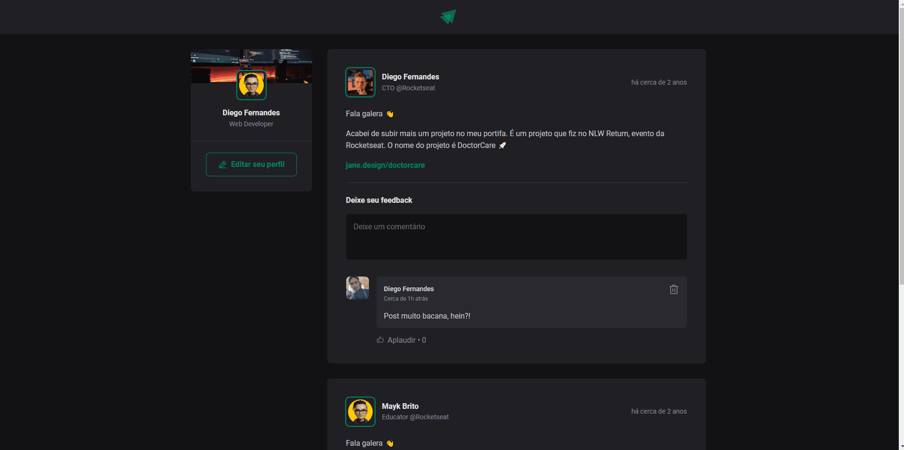

  

# Conhecimentos Adquiridos

### Geral -

- Entendi sobre como devemos evitar a otimização prematura, porque talvez possamos estar piorando sua mantenabilidade.

- Aprendi sobre a tag ``time`` e seu atributo ``dateTime``, pois é a melhor forma de demonstrar um período de uma publicação na aplicação, e a importância de implentar um título para que o usuário possa compreender melhor a data e o horário da publicação.

  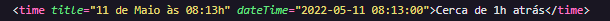

- Outro ponto importante é o conceito de componentes controlados no formulário, adicionando comentários com textos baseados no que digitamos no input.

  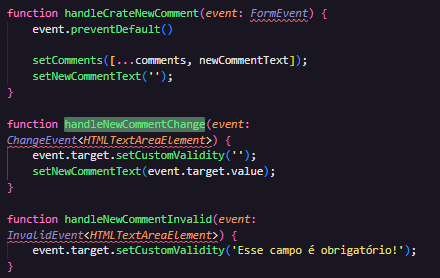
  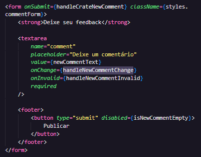

- Conheci mais uma biblioteca nova como o Date FNS, para poder formatar a data que é retornada pelo new Date, e altera-lá para o idioma português.

  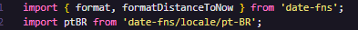

  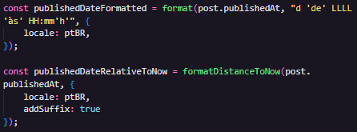

  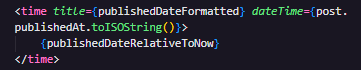

### Métodos do TypeScript -

- Conheci novos conceitos de se utilizar generics TypeScript, como nesse exemplo de quando à alteração nos elementos de um formulário aplicamentos um generics no FormEvent.

  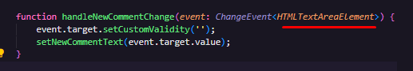

- Como adicionar através do TypeScript todas as propriedades de uma tag HTML no component.

  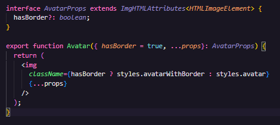

### Métodos de estilização no CSS -

- Aprendi sobre como utilizar o ModuleCSS, podendo manter apenas toda configuração de sua estilização no escopo do meu componente, evitando bugs em projetos muito maiores com o mesmo nome de classe.

  

- Conheci melhor sobre o uso do estilo de imagem object-fit: cover, fazendo com que a imagem se ajuste ao centro e na resolução definida.

  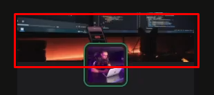

- Utilizando sinal de cruz '+' para aplicar o estilo no post, excluindo o primeiro elemento com a classe post.

  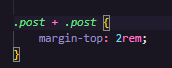

- O sinal de maior '>' serve para estilizar o header no mesmo nível do elemento.

  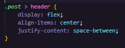

- Com o focus-within, se houver qualquer focus em um elemento dentro da classe, podemos aplicar um efeito na classe que deseja estilizar.

  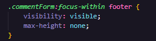

## Curiosidade

Estou bastante entusiasmando em estudar com o professor Diego Fernandes, sua nível de conhecimento técnico é muito incrível, e ensina muito bem!

## Tecnologias

<ul>
<li>HTML</li>
<li>CSS</li>
<li>JavaScript</li>
<li>TypeScript</li>
<li>React</li>
</ul>
